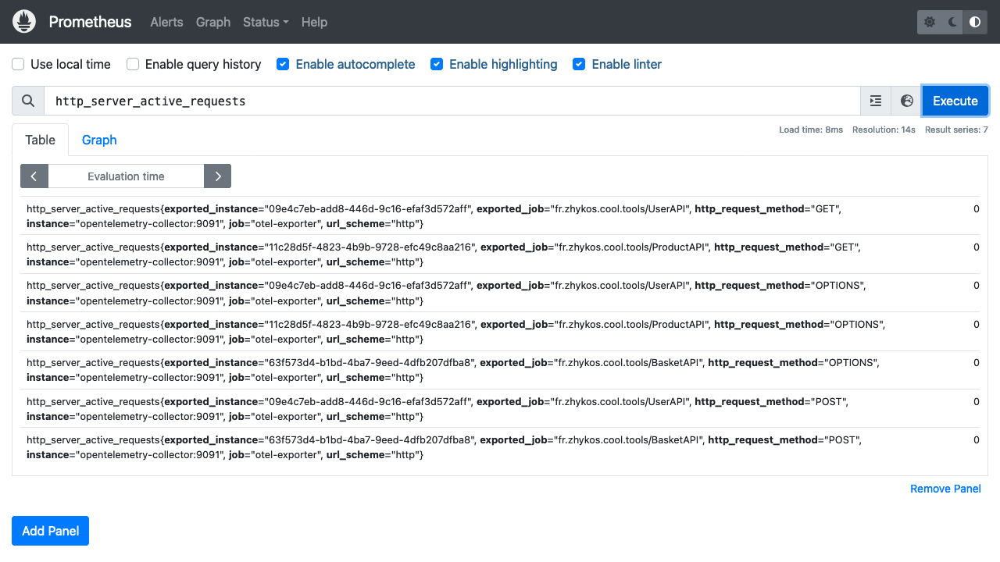
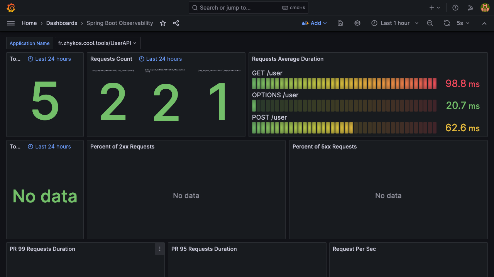
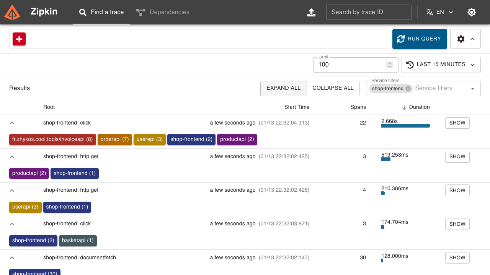
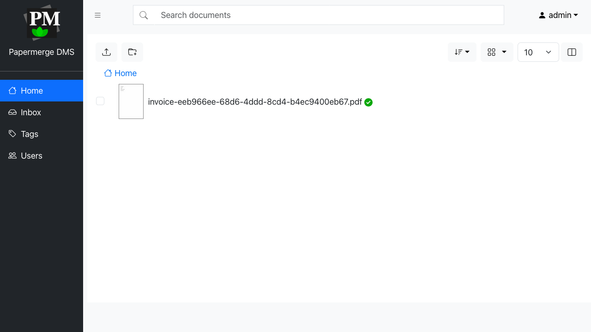
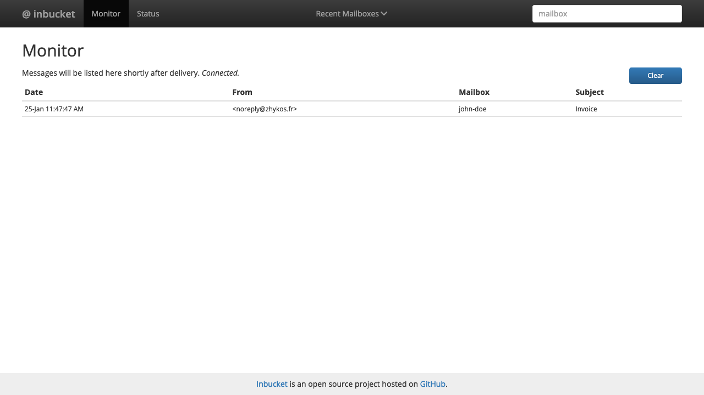
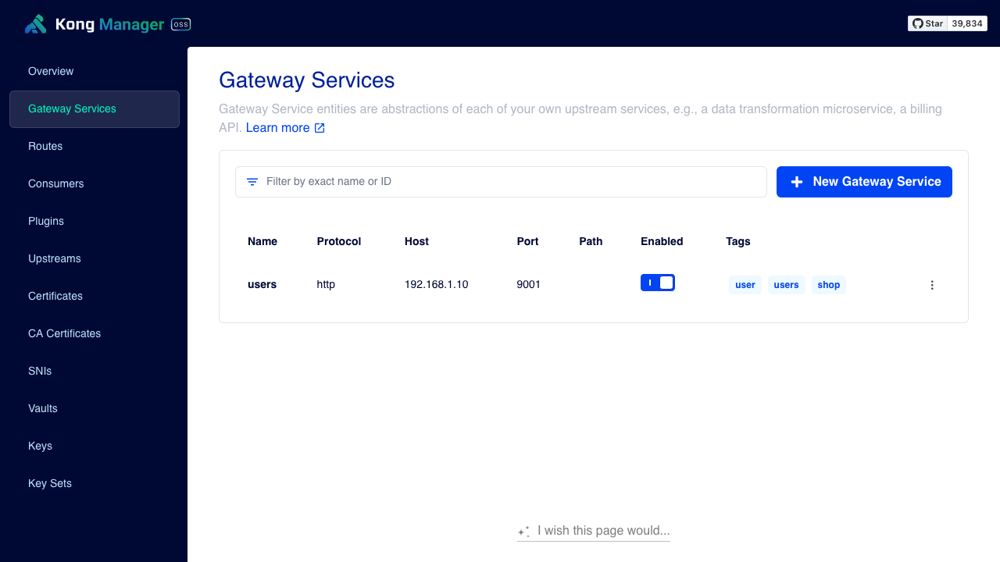
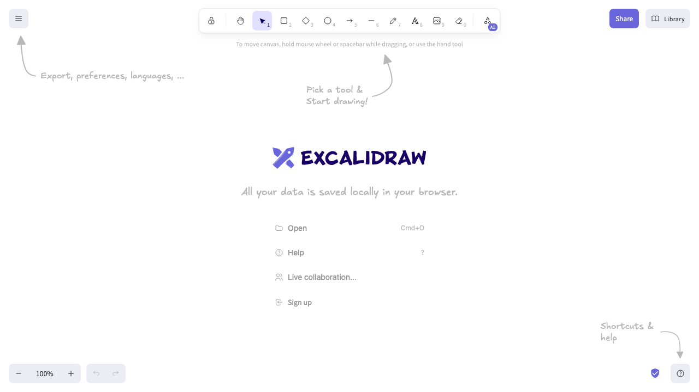

# Software infrastructure for the Cool Tools project

This project contains the infrastructure for the Cool Tools project.
It uses Docker Compose to run the services.

## Software infrastructure and tools

### Services list

The infrastructure consists of the following services:
- Prometheus: monitoring and alerting toolkit
- OpenTelemetry Collector: observability data collection and processing
- Loki: log aggregation system
- Grafana: visualization and monitoring tool
- Zipkin: distributed tracing system
- Postgres: relational database
- MongoDB: NoSQL database
- Zookeeper: distributed coordination service
- Kafka: distributed event streaming platform
- Kafka UI: web interface for Kafka
- Papermerge: document management system
- Inbucket: fake SMTP server for testing
- Kong: API gateway
- Excalidraw: whiteboard tool

### Details

Here are the details of the services.

#### Prometheus

Prometheus is an open-source monitoring and alerting toolkit.
It collects metrics from configured targets at given intervals, evaluates rule expressions, displays the results, and can trigger alerts if some condition is observed to be true.

Website: https://prometheus.io/

Open the Prometheus web interface at http://localhost:9090/



#### OpenTelemetry Collector

OpenTelemetry Collector is a vendor-agnostic agent for observability data collection and processing.
It is part of the OpenTelemetry project, which provides a single set of APIs, libraries, agents, and instrumentation to capture distributed traces and metrics from your application.

Website: https://opentelemetry.io/

Collector: https://opentelemetry.io/docs/collector/

Collectors are configured with a configuration file in YAML format.
Ports are exposed for the following ports:
- 4317 for HTTP
- 4318 for gRPC

#### Loki

Loki is a horizontally-scalable, highly-available, multi-tenant log aggregation system inspired by Prometheus.

Website: https://grafana.com/oss/loki/

Ports are exposed for the following port: 3100.

#### Grafana

Grafana is a multi-platform open-source analytics and interactive visualization web application.

Website: https://grafana.com/

Open the Grafana web interface at http://localhost:3000/

Some dashboards are available in the project, in the `grafana` directory.
Go to the Grafana web interface and import the dashboards from the JSON files.
Check the official documentation for more information: https://grafana.com/docs/grafana/latest/reference/export_import/.



#### Zipkin

Zipkin is a distributed tracing system.

Website: https://zipkin.io/

Open the Zipkin web interface at http://localhost:9411/



#### Postgres

PostgreSQL is a powerful, open-source object-relational database system.

Website: https://www.postgresql.org/

Connect to the database with the following credentials:
- Host: localhost
- Port: 9012
- Database: db
- User: user
- Password: password

#### MongoDB

MongoDB is a general-purpose, document-based, distributed database built for modern application developers and for the cloud era.

Website: https://www.mongodb.com/

Connect to the database with the following credentials:
- Host: localhost
- Port: 9014
- User: root
- Password: password

#### Zookeeper

Zookeeper is a distributed coordination service.

Website: https://zookeeper.apache.org/

Ports are exposed for the following port: 2181 for client connections

#### Kafka

Kafka is a distributed event streaming platform.

Website: https://kafka.apache.org/

Connect to the Kafka broker with the following port: 9092.

#### Kafka UI

Kafka UI is a web interface for Kafka.

Website: https://docs.kafka-ui.provectus.io/

Open the Kafka UI web interface at http://localhost:8085/

#### Papermerge

Papermerge is an open-source document management system (DMS).

Website: https://papermerge.com/

Open the Papermerge web interface at http://localhost:12000/

Connect to the DMS with the following credentials:
* User: admin
* Password: admin
* Security token: 12345



#### Inbucket

Inbucket is an email testing service.

Website: https://www.inbucket.org/

Open the Inbucket web interface at http://localhost:9000/

Send emails to the SMTP server at localhost:2500.



#### Kong

Kong is an open-source API Gateway and Microservices Management Layer, delivering high performance and reliability.

Website: https://konghq.com/

Connect to the Kong Admin API with the following port: 8002.

To backup and restore Kong configuration, you can use Kong Deck:

* Install deck: https://docs.konghq.com/deck/latest/installation/
* Then: https://docs.konghq.com/deck/latest/guides/backup-restore/

Export configuration:

```bash
cd kong
deck gateway dump -o kong.yaml
```

Import configuration:

```bash
cd kong
deck gateway diff kong.yaml
deck gateway sync kong.yaml
```



#### Excalidraw

Excalidraw is a whiteboard tool.

Website: https://excalidraw.com/

Open the Excalidraw web interface at http://localhost:3030/



## Getting Started

These instructions will give you a copy of the project and running on
your local machine for development and testing purposes.

### Prerequisites

Requirements for the software and other tools to build and run the API
- Docker and Docker Compose

You also need your computer IP address: `ipconfig getifaddr en0` could do the trick. If you are here, you must know how to find it if the previous command does not work. You also can check https://www.wikihow.com/Check-a-Computer-IP-Address or another website.

### Running the infrastructure

Before starting the infrastructure, you must set your current IP address in these files:
- `./kong/dockerfile`
- `./kong/kong.yaml`

Replace `192.168.1.10` with your IP address in all files (see previous paragraph). It will be easy if you are using an IDE like VS Code, Zed or IntelliJ.

> If you are using a Apple Silicon CPU (M1, M2, etc.), you'll need to get Papermerge with a specific command: `docker pull --platform linux/amd64  papermerge/papermerge:xxx` (replace `xxx` with the correct version specified in the `docker-compose.yml` file). More information about the 3.4 version, for instance: https://docs.papermerge.io/3.4/setup/docker/#apple-m1-m2-users.

Start the infrastructure with the following command:

```bash
docker compose up -d --build
```

To stop the infrastructure, use the following command:

```bash
docker compose down -v
```

## Improvements

- Well... it's just an infrastructure, so it's perfect! 😅

## Contributing

Please read [CONTRIBUTING.md](../CONTRIBUTING.md) for details on our code
of conduct, and the process for submitting pull requests to us.

## Versioning

We use [Semantic Versioning](http://semver.org/) for versioning.

## Authors

- **Thomas Cicognani** - *First version of the API* -
  [Zhykos](https://github.com/Zhykos)

## Acknowledgments

- PurpleBooth 🖤 for the README template: https://github.com/PurpleBooth/a-good-readme-template
- Hat tip to anyone whose code is used
