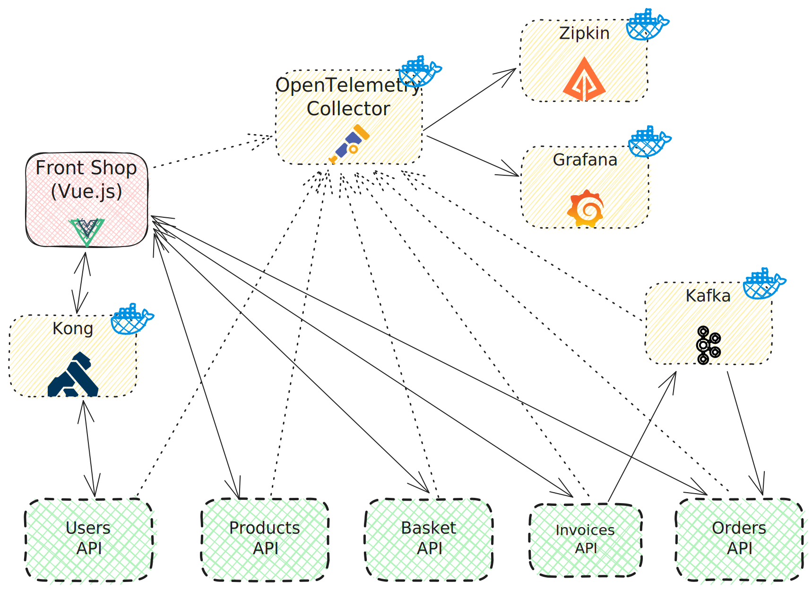

<h1 align="center">
  <br>
  
  <br>
  Cool tools
  <br>
</h1>

<h4 align="center">My selection of cool tools: frameworks, languages, tools, libraries, applications, software I think are cool. And are free.</h4>

<p align="center">
  <a href="#description">Description</a> •
  <a href="#how-to-use">How To Use</a> •
  <a href="#credits">Credits</a> •
  <a href="#kudos">Kudos</a> •
  <a href="#license">License</a>
</p>



## Description

This project is my space to learn and experiment new things.
Some things already need to be improved, like the architecture, the performance, etc.
So, if you want to help me, to tell me new cools tools are released, I will be happy to work with you.

I started this project to learn about the OpenTelemetry project, when I heard about it.
I thought it was a cool project, and I wanted to learn more about it.

I tried to write articles about the tools OpenTelemetry in my previous jobs, but I never had the time to do it.
And when I had the time, the articles were not published...

So I made a project with a simple architecture and a little online shop.
I wrote some microservices, and I wanted to add the OpenTelemetry project to it.
And then it become bigger and bigger, a real project to try and learn new things.

Here are all the tools I used in this project with their versions released on Docker Hub:

<p align="center">
   •
   •
   •
   •
   •
   •
   •
   •
   •
   •
   •
   •
   •
  
</p>

* [Prometheus](https://prometheus.io/)
* [Loki](https://grafana.com/oss/loki/)
* [Zipkin](https://zipkin.io/)
* [Grafana](https://grafana.com/)
* [OpenTelemetry](https://opentelemetry.io/)
* [OpenTelemetry Collector](https://opentelemetry.io/docs/collector/)
* [Postgres](https://www.postgresql.org/)
* [MongoDB](https://www.mongodb.com/)
* [Zookeeper](https://zookeeper.apache.org/)
* [Kafka](https://kafka.apache.org/)
* [Kafka UI](https://docs.kafka-ui.provectus.io/)
* [Papermerge](https://www.papermerge.com/)
* [Inbucket](https://www.inbucket.org/)
* [Kong](https://konghq.com/)
* [Excalidraw](https://excalidraw.com/)

Thus we will use the following tools:
* [Docker](https://www.docker.com/)
* [Docker Compose](https://docs.docker.com/compose/)

The project contains several directories (a README.md file is present in each directory):
* [BasketAPI](./BasketAPI/README.md): a simple API to manage a basket made with Play Framework
* [BenchmarkOpenTelemetryCollector](./BenchmarkOpenTelemetryCollector/README.md): a simple project to benchmark the OpenTelemetry Collector
* [front-home](./front-home/README.md): a simple front-end to display the home page, made with Vue.js
* [Infra](./Infra/README.md): the infrastructure of the project, made with Docker Compose
* [InvoiceAPI](./InvoiceAPI/README.md): a simple API to manage invoices, made with Java and Quarkus
* [OrderAPI](./OrderAPI/README.md): a simple API to manage orders, made with Go
* [ProductAPI](./ProductAPI/README.md): a simple API to manage products, made with Java and Spring Boot (WebFlux)
* [UserAPI](./UserAPI/README.md): a simple API to manage users, made with Java and Spring Boot.

You'll find a complete architecture documentation with the file [arch.plantuml](./arch.plantuml).
It uses the [PlantUML](https://plantuml.com/) language and [Archimate](https://www.archimatetool.com/) to describe the architecture.
Careful, I'm not an expert in Archimate, so the file may contain errors.

## How To Use

You will need Docker and Docker Compose to run this project.

Download and install Docker from [here](https://www.docker.com/get-started).

Then, to get the project, clone it with [Git](https://git-scm.com). From your command line:

```bash
# Clone this repository
$ git clone https://github.com/zhykos/microservices-cool-tools

# Go into the repository
$ cd microservices-cool-tools

# Start the Docker Compose: for more information, see the README.md file in the Infra directory
$ cd Infra
$ docker-compose up -d

# Run all applications
# For more information, see the README.md file in each directory
```

## Credits

Check credits in each directory.

- [README template](https://github.com/amitmerchant1990) by Amit Merchant
- I wish to not generate a header with IA so I used an image by <a href="https://unsplash.com/fr/@growtika">Growtika</a> on <a href="https://unsplash.com/fr/photos/un-ordinateur-avec-un-clavier-et-une-souris-yGQmjh2uOTg">Unsplash</a>
- Everyone, somehow, because I used Copilot to help me write the code

## Kudos

Documentation and articles I used and help me a lot to create this project:

* https://blog.ght1pc9kc.fr/2023/grafana-stack-1.-observabilit%C3%A9-avec-spring-boot-3/
* https://grafana.com/grafana/dashboards/17175-spring-boot-observability/
* https://ilaydadastan.com/log-analysis-and-visualization-with-grafana-loki-and-opentelemetry-7e3ea3c78895
* https://pkg.go.dev/github.com/open-telemetry/opentelemetry-collector-contrib/cmd/telemetrygen
  * `telemetrygen traces --otlp-insecure --duration 50s`
* https://opentelemetry.io/docs/zero-code/java/spring-boot-starter/
* https://www.baeldung.com/ops/kafka-new-topic-docker-compose

## License

MIT: [LICENSE](LICENSE) for more information.

---

> [zhykos.fr](https://www.zhykos.fr) &nbsp;&middot;&nbsp;
> GitHub [@zhykos](https://github.com/Zhykos) &nbsp;&middot;&nbsp;
> Bluesky [@zhykos](https://bsky.app/profile/zhykos.bsky.social)
